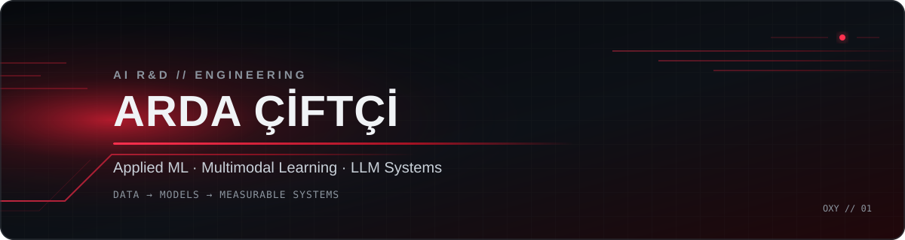

### AI R&D Intern · Computer Engineering Student

I build applied machine learning, multimodal deep learning and production-minded AI systems.

## Focus

- Applied machine learning with measurable evaluation and reproducible experiments
- Multimodal learning, clinical AI, RAG and LLM-based systems
- Production-aware development across Python, C++ and .NET

## Selected work

| Project | Engineering signal |
| --- | --- |
| [Multimodal Clinical Reasoning](https://github.com/buraksamisirin/multimodal-clinical-reasoning) | Collaborative research project using BiomedCLIP + GPT-2, cross-attention and four controlled ablation variants evaluated on 1,000 samples. |
| [Urban Mobility & Mood](https://github.com/buraksamisirin/urban-mobility-mood) | Collaborative study of 974 days of Istanbul data; statistical testing and eight ML benchmarks for mood forecasting. |
| [Customer Churn Prediction](https://github.com/OxyOxygen/Customer_Churn_Prediction) | CatBoost pipeline with 60 engineered features, five-fold validation and competition-specific evaluation metrics. |
| [AI Workstation Monitor](https://github.com/OxyOxygen/System_Monitor) | C++17 telemetry suite with modular hardware providers, asynchronous polling and AI-workstation diagnostics. |

## Core stack

Build deliberately. Measure everything.

