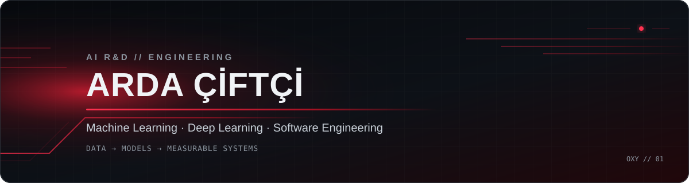

### AI R&D Intern · Computer Engineering Student

I build applied machine learning, deep learning and production-minded AI systems.

## Focus

- Applied machine learning with measurable evaluation and reproducible experiments
- Deep learning, computer vision, NLP, RAG and LLM-based systems
- Production-aware development across Python, C++ and .NET

## Selected work & contributions

| Project | My work / engineering signal |
| --- | --- |
| [Multimodal Clinical Reasoning](https://github.com/buraksamisirin/multimodal-clinical-reasoning) · [Research Card](https://huggingface.co/arxp/multimodal-clinical-reasoning) | **Contributor** — cleaned and analyzed VQA-RAD data, engineered 34 multimodal/clinical features and documented the dataset findings. |
| [Urban Mobility & Mood](https://github.com/buraksamisirin/urban-mobility-mood) · [Live Space](https://huggingface.co/spaces/arxp/istanbul-mobility-mood-explorer) | **Contributor** — implemented statistical analysis and ML model selection across regression and classification experiments. |
| [EurasiaAirlines](https://github.com/buraksamisirin/EurasiaAirlines) | **Contributor** — implemented database and authentication setup, flight-seat workflows, ticket purchasing and passenger booking views in ASP.NET MVC. |
| [AI Workstation Monitor](https://github.com/OxyOxygen/System_Monitor) | Built a C++17 telemetry suite with modular hardware providers, asynchronous polling and AI-workstation diagnostics. |

## Core stack

Build deliberately. Measure everything.

